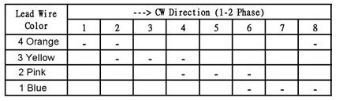
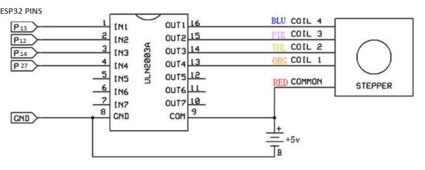
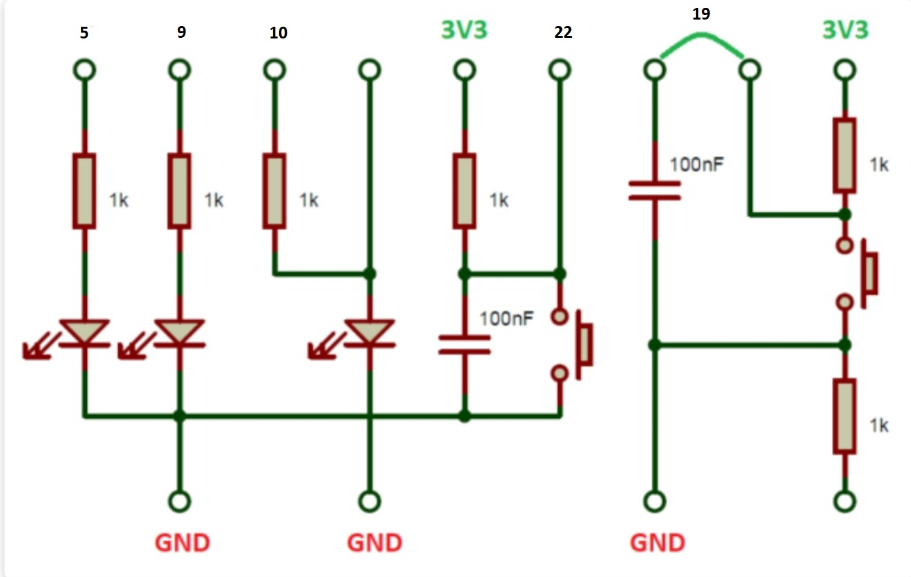

Projeto EDM 2020/2021
======
# T02B10: Controlo de um motor passo-a-passo 

#### Elaborado por:
- Eduardo Rodrigues
- Sara Barros

## Sumário
* [Objetivo do Projeto](#tag_sec_1)
* [Componentes e Montagem](#tag_sec_2)
* [Código e Funcionamento](#tag_sec_3)
* [Conclusão](#tag_sec_4)


## <a name="tag_sec_1"></a> Objetivo do Projeto
Como projeto final da cadeira de Eletrónica Digital e Microprocessadores, pretende-se tirar partido das funcionalidades do ESP32 estudado nas aulas de forma a controlar um motor passo-a-passo. 
O trabalho foi desenvolvido em MicroPython e utilizando o ambiente de desenvolvimento Visual Studio Code.
Optou-se por abordar o projeto como se o motor passo-a-passo fosse um portão cuja abertura e fecho se controla através de botões e com a indicação do seu estado através de Leds.


## <a name="tag_sec_2"></a> Componentes e Montagem

#### Componentes

- Motor passo-a-passo 28BYJ-48
- Controlador ULN2003
- ESP32
- Placa com LEDs e botões

#### Motor passo-a-passo 28BYJ-48

O motor 28BYJ-48 é um motor passo-a-passo de 5V que converte pulsos elétricos em rotações mecânicas discretas (steps).
Este motor consiste em quatro bobinas posicionadas à volta do motor.


Ativando as bobinas numa certa sequência, é possível controlar o movimento do motor. Na seguinte tabela tem-se a sequência necessária para um movimento de rotação no sentido horário:



#### Ligações com controlador e a placa ESP32 

O motor é ligado a um controlador ULN2003 que por sua vez estabelece a ligação com a placa ESP32 e a fonte de alimentação, conforme a seguinte figura:

 

#### Botões e LEDs

Os botões e LEDs usados no projeto foram ligados da maneira convencional usada durante as aulas, conforme o esquema seguinte:



## <a name="tag_sec_3"></a> Código e Funcionamento

#### Significado dos LEDs

Para marcar o início do programa, todos os leds se acendem em escada e depois piscam três vezes e, por fim, fica apenas o led vermelho aceso (ficheiro boot.py).

Durante o funcionamento do programa, o led vermelho encontra-se aceso sempre que o portão esteja fechado.
Quando o portão executa movimento, quer seja a abrir ou a fechar, acende-se o led amarelo.
Quando o portão se encontra aberto, acende-se o led verde.


#### Variáveis de controlo

```python
x = 0  # control variable
steps = 0  # steps counter
voltas = 1  # number of full turns to fully open
speed = 2  # regulates the speed(the lower the faster)
time_open_s = 5  # time to remain open before closing automatically
steps_gone = 0  # number of steps already closed
```
A variável *x* controla o estado em que se encontra o ''portão'':
- fechado/a abrir --->   x = 0
- aberto/ a fechar --->  x = 1

*steps* e *steps_gone* recolhe informação sobre quantos passos é que o portão abriu e quantos passos é que o portão já fechou, respetivamente.


Insere-se um valor *voltas* que corresponde às voltas completas que se deseja que o motor realize até que se considere totalmente 'aberto'.
Pode-se controlar a velocidade do motor inserindo um valor inteiro em *speed*, sendo o mais rápido possível com o valor 1.
*time_open_s* regula o tempo que o ''portão'' permanece aberto antes de fechar automaticamente (em segundos).

#### Input para o motor passo-a-passo

```python
A_CLOCK = [[0, 0, 0, 1], [0, 0, 1, 1], [0, 0, 1, 0], [0, 1, 1, 0], [
    0, 1, 0, 0], [1, 1, 0, 0], [1, 0, 0, 0], [1, 0, 0, 1]]  
CLOCK = [[1, 0, 0, 1], [1, 0, 0, 0], [1, 1, 0, 0], [0, 1, 0, 0], [
    0, 1, 1, 0], [0, 0, 1, 0], [0, 0, 1, 1], [0, 0, 0, 1]]  
```
Valores referidos na tabela acima que permitem controlar o motor passo-a-passo, ativando as suas resistências numa certa sequência.
*A_CLOCK* e *CLOCK* definem a sequência necessária para girar o motor no sentido anti-horário e horário, respetivamente.

#### Funções *spin* e *stop_go*
A função *spin* é responsável pelo movimento do motor e conta com a variável sentido que pode ser *A_CLOCK* ou *CLOCK*. Vai também controlar a velocidade *speed* de rotação.
```python
def spin(sentido):  # funtion that makes the 28BYJ-48 spin
    for i in sentido:
        In1.value(i[0])
        In2.value(i[1])
        In3.value(i[2])
        In4.value(i[3])
        utime.sleep_ms(speed)
    In1.value(0)
    In2.value(0)
    In3.value(0)
    In4.value(0)
```
A função *stop_go* define o movimento de fecho em que o motor vai continuar a executar passos de fecho na direção CLOCK enquanto o número de passos de fecho não for igual ao número de passos que realizou para abrir.
(ou seja, vai continuar a fechar enquanto *steps_gone* for diferente de *steps*).
Se o botão direito ou esquerdo for premido, o movimento interrompe.
```python
def stop_go():      # function to control the closing
    global steps
    global steps_gone
    global t

    for j in range(int(steps-steps_gone)):
        spin(CLOCK)
        steps_gone += 1
        if steps_gone == steps:
            return None

        if button_right.value() == 0 or button_left.value() == 0:
            utime.sleep_ms(500)
            return None

    return None
```
#### Ciclo de Funcionamento
Como referido anteriormente, o estado do ''portão'' vai ser controlado pela variável **x**. Quando x tem o valor 0, o portão está fechado ou a abrir. 
Quando x tem o valor 1 o portão está aberto ou a fechar.
Ao iniciar o programa, assume-se a posição de fechado, ou seja, x tem valor 0.

Quando **x = 0**:

- Se for premido o botão esquerdo: o portão abre totalmente no sentido A_CLOCK e, no final do movimento, passa agora para o estado x = 1. Se durante o movimento for premido qualquer um dos botões, o portão para.
- Enquanto o botão direito estiver premido, o portão abre. Quando se larga o botão, o movimento interrompe-se e passa-se para o estado x = 1.
```python
while x == 0:
        if button_left.value() == 0:  # when left button pressed opens the gate fully
            red_led.value(False)
            yellow_led.value(True)
            # small delay to start spinning to avoid double button press detection
            utime.sleep_ms(500)
            for j in range(int(voltas*509)):
                spin(A_CLOCK)
                steps += 1
                if button_left.value() == 0 or button_right.value() == 0:  # if button pressed stops
                    break
            yellow_led.value(False)
            green_led.value(True)
        x = 1

        while button_right.value() == 0:        # while the right button is pressed it opens
            red_led.value(False)
            yellow_led.value(True)
            spin(A_CLOCK)
            steps += 1
            if button_right.value() == 1:
                x = 1  # when released changes state
                yellow_led.value(False)
                green_led.value(True)
```
Quando **x = 1**:

- O portão fica aberto durante *time_open_s* segundos e depois executa o movimento de fecho (função *stop_go*).
- Se antes disso um dos botões for premido, o portão começa a fechar.
- Como definido na função *stop_go*, quando o botão direito ou esquerdo for premido, o movimento é interrompido.
- Quando o número de passos que o portão fechou for igual ao número de passos que o portão abriu (quando *steps_gone* for igual a *steps*), o estado volta a ser x = 0, o led vermelho acende e as variáveis *step* e *step_gone* resetam-se, completando-se assim um ciclo de funcionamento.
  
```python
 while x == 1:
        t = utime.time()
        while steps != steps_gone:
            utime.sleep_ms(500)
            if button_right.value() == 0 or button_left.value() == 0:
                yellow_led.value(True)
                green_led.value(False)
                utime.sleep_ms(500)
                stop_go()
                yellow_led.value(False)
                if steps != steps_gone:
                    green_led.value(True)
                t = utime.time()

            if utime.time()-t == time_open_s:
                yellow_led.value(True)
                green_led.value(False)
                stop_go()
                yellow_led.value(False)
                if steps != steps_gone:
                    green_led.value(True)
                t = utime.time()

        x = 0
        red_led.value(True)
        steps = 0
        steps_gone = 0
```


## <a name="tag_sec_4"></a> Conclusão

Neste projeto alcançou-se o objetivo de simular o comportamento de um portão, controlando um motor passo-a-passo através do microcontrolador ESP32. Programou-se também a placa de botões e LEDs de forma a controlar o motor e a visualizar o seu estado. Para realizar o trabalho foi utilizado o software Visual Studio Code e programou-se em micropython.

O projeto funciona da seguinte forma:

Pressionando uma vez o botão esquerdo, dá-se início a um ciclo de abertura e fecho do portão (com um certo tempo de paragem *times_gone_s* quando aberto). A qualquer momento deste ciclo, o movimento é interrompido ao pressionar o botão direito ou esquerdo.

Pressionando continuamente o botão direito, o portão abre até que se largue o botão. Executa depois o movimento de fecho que pode ser novamente interrompido ao pressionar qualquer botão.

É ainda possível escolher a velocidade do motor e o tempo que este permanece ''aberto'' antes de começar a fechar.
